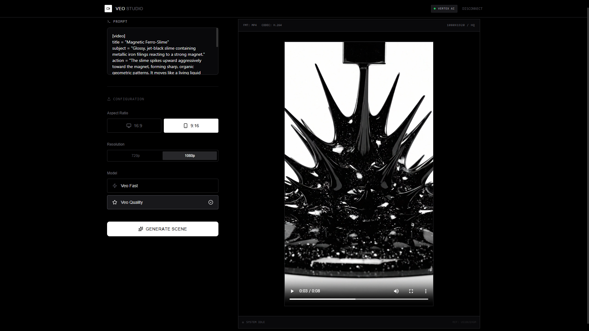

# Veo Video Studio

[<video src="assets/Crystal_Slime_Cube_Impact.mp4" controls muted playsinline width="480" poster="assets/preview.png"></video>](assets/Crystal_Slime_Cube_Impact.mp4)
[<video src="assets/Deep_Space_Pearl_Swirl_Video_Generation.mp4" controls muted playsinline width="480" poster="assets/preview.png"></video>](assets/Deep_Space_Pearl_Swirl_Video_Generation.mp4)
[<video src="assets/Slime_and_Honeycomb_Crunch_Video.mp4" controls muted playsinline width="480" poster="assets/preview.png"></video>](assets/Slime_and_Honeycomb_Crunch_Video.mp4)

## Run Locally

1. Install dependencies:
   `bun install`
2. Run the app:
   `bun run dev`

## Authenticate with Google Cloud

- Upload your Google Cloud Service Account JSON in the app's lock screen to authenticate.
- The key is processed locally in your browser and never sent to any server.
- Required fields: `type`, `project_id`, `private_key_id`, `private_key`, `client_email`, `client_id`, `auth_uri`, `token_uri`, `auth_provider_x509_cert_url`, `client_x509_cert_url`, `universe_domain`.

## Production Notes

- Keep credentials in memory only and clear when disconnecting.
- Use HTTPS and a secure origin to enable WebCrypto for JWT signing.
